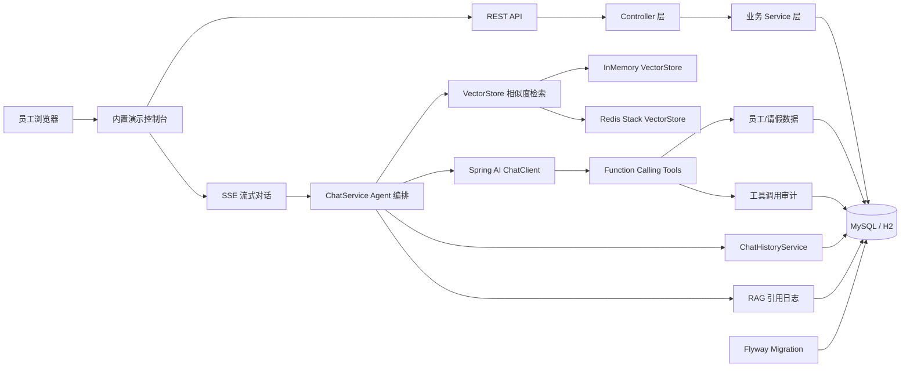
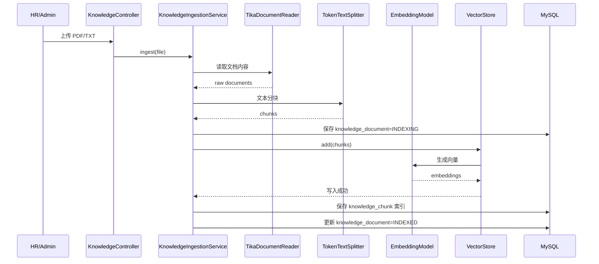
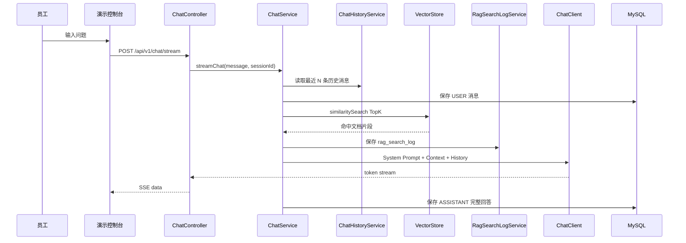
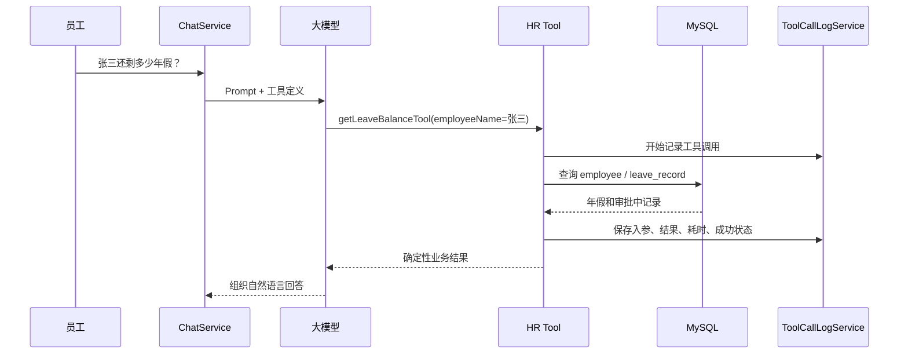

# Enterprise HR AI Agent 架构说明

## 1. 总体架构

核心分层：

- 前端演示层：Spring Boot 静态资源，访问 `http://localhost:8080/`。
- API 层：RESTful API + SSE 流式接口。
- Agent 编排层：`ChatService` 负责 RAG、历史消息、Prompt、ChatClient 流式输出。
- 工具层：`HrToolsConfig` 暴露 Function Calling 工具。
- 数据层：MySQL + MyBatis-Plus，测试和 local profile 使用 H2。
- 向量层：默认 InMemoryVectorStore，`redis` profile 可切换 Redis Stack。
- 工程化：Flyway、Swagger、Actuator、统一异常、轻量级鉴权、CORS、CI。

## 2. RAG 入库流程

这个流程体现了 RAG 的知识更新能力：公司制度可以通过上传文档进入知识库，不依赖模型训练数据。

## 3. 对话与 RAG 检索流程

重点设计：

- `Context` 只来自向量检索命中的制度片段。
- 历史消息只帮助理解上下文，不作为制度依据。
- `rag_search_log` 记录模型回答前检索到了哪些片段，便于排查和展示引用来源。

## 4. Function Calling 时序

重点设计：

- 模型负责理解用户意图和组织回答。
- 工具负责提供确定性业务数据。
- 审计日志记录模型访问内部能力的全过程。

## 5. 数据库职责划分

| 表 | 作用 |
| --- | --- |
| `employee` | 员工基础信息、年假总数、已用年假 |
| `leave_record` | 请假记录和审批状态 |
| `knowledge_document` | 知识库文档元数据 |
| `knowledge_chunk` | 文档 chunk 和向量 ID 的关联 |
| `chat_session` | 对话会话 |
| `chat_message` | 对话消息 |
| `rag_search_log` | RAG 检索引用来源 |
| `tool_call_log` | Function Calling 工具调用审计 |

## 6. 关键代码入口

| 模块 | 文件 |
| --- | --- |
| Agent 编排 | `src/main/java/com/example/enterprisehraiagent/service/ChatService.java` |
| RAG 入库 | `src/main/java/com/example/enterprisehraiagent/service/KnowledgeIngestionService.java` |
| 工具定义 | `src/main/java/com/example/enterprisehraiagent/tool/HrToolsConfig.java` |
| RAG 日志 | `src/main/java/com/example/enterprisehraiagent/service/RagSearchLogService.java` |
| 工具审计 | `src/main/java/com/example/enterprisehraiagent/service/ToolCallLogService.java` |
| AI 配置 | `src/main/java/com/example/enterprisehraiagent/config/AiConfig.java` |
| 向量库配置 | `src/main/java/com/example/enterprisehraiagent/config/VectorStoreConfig.java` |
| 演示控制台 | `src/main/resources/static/index.html` |

## 7. 面试讲解顺序

1. 先说明业务目标：统一 HR 对话窗口。
2. 讲 RAG：制度问题必须基于企业知识库。
3. 讲 Function Calling：个人数据必须查内部系统。
4. 讲 SSE：大模型回答需要流式体验。
5. 讲工程化：Flyway、测试、CI、Swagger、异常、鉴权、CORS。
6. 讲可观测性：RAG 引用来源和工具调用审计。
